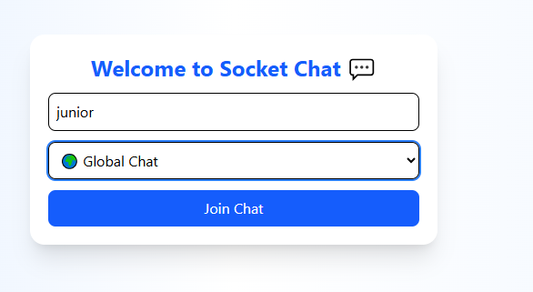

# Real-Time Chat Application with Socket.io

This assignment focuses on building a real-time chat application using Socket.io, implementing bidirectional communication between clients and server.

## Assignment Overview

You will build a chat application with the following features:
1. Real-time messaging using Socket.io
2. User authentication and presence
3. Multiple chat rooms or private messaging
4. Real-time notifications
5. Advanced features like typing indicators and read receipts

## Project Structure

```
socketio-chat/
├── client/                 # React front-end
│   ├── public/             # Static files
│   ├── src/                # React source code
│   │   ├── components/     # UI components
│   │   ├── context/        # React context providers
│   │   ├── hooks/          # Custom React hooks
│   │   ├── pages/          # Page components
│   │   ├── socket/         # Socket.io client setup
│   │   └── App.jsx         # Main application component
│   └── package.json        # Client dependencies
├── server/                 # Node.js back-end
│   ├── config/             # Configuration files
│   ├── controllers/        # Socket event handlers
│   ├── models/             # Data models
│   ├── socket/             # Socket.io server setup
│   ├── utils/              # Utility functions
│   ├── server.js           # Main server file
│   └── package.json        # Server dependencies
└── README.md               # Project documentation
```

## Getting Started

1. Accept the GitHub Classroom assignment invitation
2. Clone your personal repository that was created by GitHub Classroom
3. Follow the setup instructions in the `Week5-Assignment.md` file
4. Complete the tasks outlined in the assignment

## Files Included

- `Week5-Assignment.md`: Detailed assignment instructions
- Starter code for both client and server:
  - Basic project structure
  - Socket.io configuration templates
  - Sample components for the chat interface

## Requirements

- Node.js (v18 or higher)
- npm or yarn
- Modern web browser
- Basic understanding of React and Express

## Submission

Your work will be automatically submitted when you push to your GitHub Classroom repository. Make sure to:

1. Complete both the client and server portions of the application
2. Implement the core chat functionality
3. Add at least 3 advanced features
4. Document your setup process and features in the README.md
5. Include screenshots or GIFs of your working application
6. Optional: Deploy your application and add the URLs to your README.md

## Resources

- [Socket.io Documentation](https://socket.io/docs/v4/)
- [React Documentation](https://react.dev/)
- [Express.js Documentation](https://expressjs.com/)
- [Building a Chat Application with Socket.io](https://socket.io/get-started/chat)


---

## 💡 Project Overview  

This project is a **real-time chat application** built using **React, Node.js, Express, MongoDB, and Socket.io**.  
It enables instant messaging between users, supporting both **global** and **private chats**, along with features like **file sharing, typing indicators, notifications, and read receipts**.  

The system demonstrates real-time bidirectional communication using Socket.io, with a responsive UI for both desktop and mobile devices.  

---

## ⚙️ Setup Instructions  

### 🧩 Prerequisites  
Make sure you have installed:  
- **Node.js** (v18 or above)  
- **MongoDB** (local or cloud instance)  
- **npm** or **yarn**  

---

### 🖥️ Steps to Run  

1. **Clone the repository:**  
   ```bash
   git clone https://github.com/yourusername/socketio-chat.git
   cd socketio-chat
Install dependencies:

cd server && npm install
cd ../client && npm install


Create a .env file in the server directory with:

PORT=5000
MONGO_URI=your_mongodb_connection_string


Run the server and client concurrently:

npm run dev


Open the app:
Navigate to http://localhost:5173
 in your browser.

 Features Implemented
 Core Functionality

Real-time messaging using Socket.io

Global chat room for all users

Private messaging between users

User authentication (username-based)

Online/offline status tracking

Message timestamps and sender display

 Advanced Chat Features

Typing indicators

Message reactions (❤️ )

File and image sharing

Read receipts

Searchable message history

Pagination for older messages

Multiple chat rooms/channels

 Notifications

Sound and browser notifications for new messages

“User joined/left” notifications

Unread message counter

📱 UX and Performance

Responsive layout (mobile & desktop)

Reconnection handling for Socket.io

Message delivery acknowledgment

Loading and error states

🖼️ Screenshots
🔐 Login Page

💬 Global Chat Room

📁 File Upload

🔊 Notifications

💡 Tip: Record a short GIF demo using ScreenToGif
 or Loom
 and embed it below:




🧱 Tech Stack
Layer	Technologies Used
Frontend	React, Vite, Tailwind CSS
Backend	Node.js, Express
Database	MongoDB, Mongoose
Real-time Communication	Socket.io
File Uploads	Multer
Notifications	Web Notifications API
Deployment	Render / Vercel (optional)
👩‍💻 Author

Esther Ooko


 LinkedIn

 GitHub
